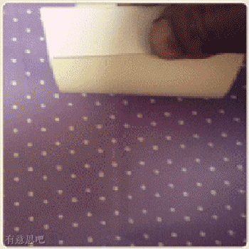

# Linux命令-练习

1.创建test目录，在里面创建aa bb cc三个目录，在aa里创建hello文件，在bb里创建world目录，在cc里创建vchaoxi.py,然后执行ls -R,最后删除test

2.查看当前Ubuntu的系统时间

3.把命令cal执行后看到的结果存放到 cal.txt文件中

4.创建一个文件 test.txt，修改其权限为 所有者可读可写，其他人没有任何权限

5.(较难，多与同学讨论)创建一个叫xiaohua的用户，然后创建一个新的用户组叫meinv，并将xiaohua用户添加到这个用户组中，然后创建一个新的文件，名字叫123.py，并修它的用户组为meinv

6.显示/proc/meminfo 文件中以大小s 开头的行( 要求：使用两种方法)

6.将所学的所有命令，至少敲2遍，并能说出其功能

